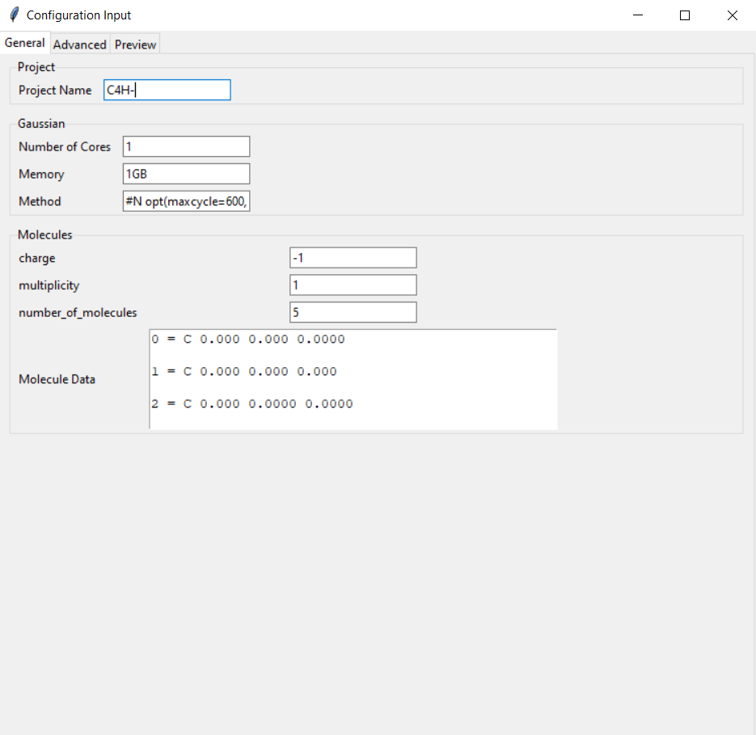
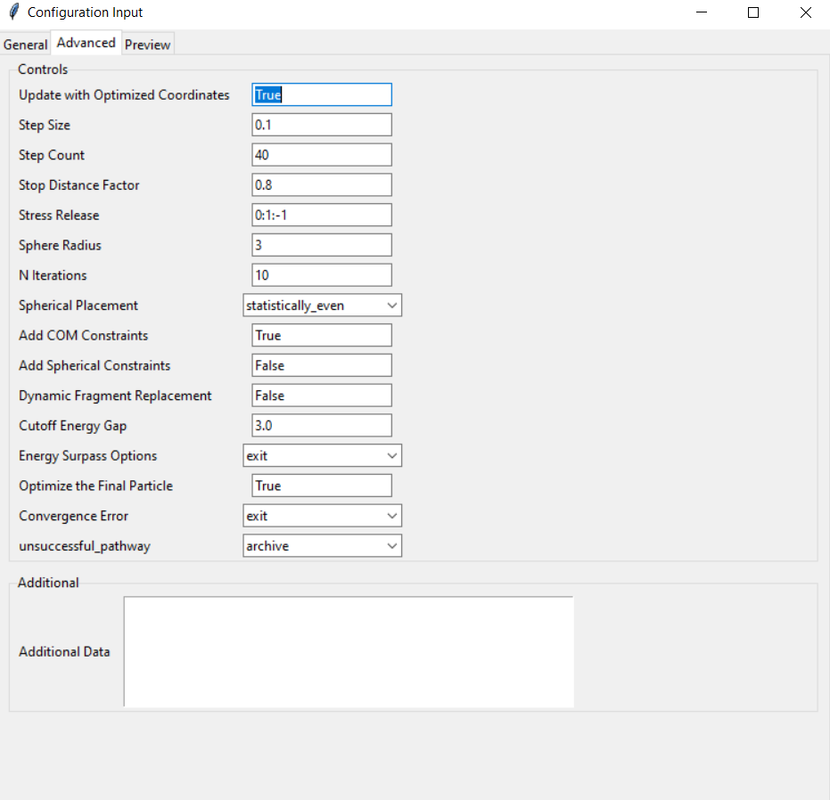
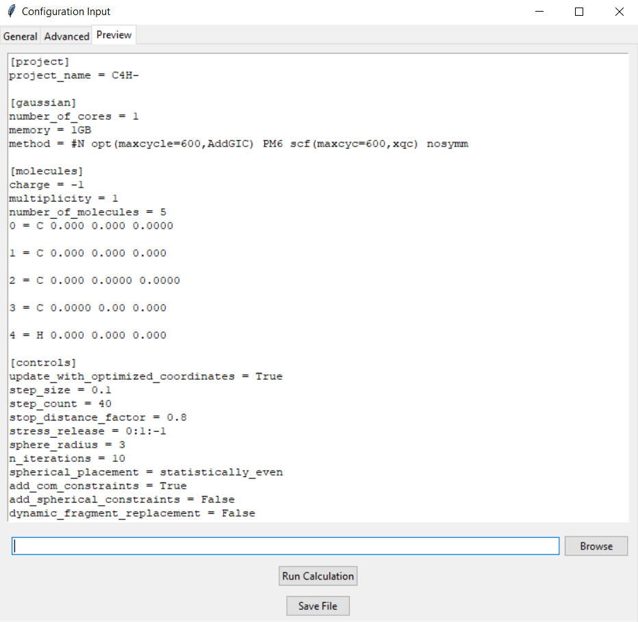

# Graphical User Interface (GUI) Documentation

## Overview

The GUI in `URPSA.py` provides a user-friendly interface for configuring input files and running calculations.

---

## Installation

Follow the instructions in [install.md](install.md) to set up dependencies for the GUI.

---

## Launching the GUI

To start the GUI, run:

```bash
python URPSA.py
```
This opens the main window where you can create or load input files.
---
## Main Window
The main window contains the three sections:

1. **General tab**: basic inputs that needs to be configured.
2. ** Advanced tab**: advanced options if more customizability is needed.
3. ** preview tab**: preview of the input file that will be generated.

### General Tab

- **Project Name**: Enter the name of your project.
- **Gaussian Settings**: Specify the number of cores, memory, and method for Gaussian calculations.
- **Number of Molecules**: Specify how many different molecules will be included.
- **Molecule Input**: Add molecule details in the format `Index = Element X Y Z`.

### Advanced Tab

- **Controls**: Configure options like `update_with_optimized_coordinates`, `step_size`, `step_count`, etc.
- **Spherical Placement**: Choose how to place molecular fragments (e.g., `Total_random`, `statistically_even`).
- **Additional Settings**: Options like `ADD_COM_CONST` and `dynamic_fragment_replacement`.

### Preview Tab

- Displays the generated input file based on your configurations.
- save the input file by clicking the "Save Input File" button.
- tell the path for the repeated.py script by clicking the "Set Script Path" button.
- Run the calculation by clicking the "Run Calculation" button.

### HOW TO USE
1. Fill in the required fields in the General and Advanced tabs.
2. Switch to the Preview tab to review the generated input file.
3. Save the input file 
4. specify the path to `repeated.py` by clicking `Browse` button.
5. Click "Run Calculation" to start the process.


The GUI will execute the `repeated.py` script with the generated input file.

