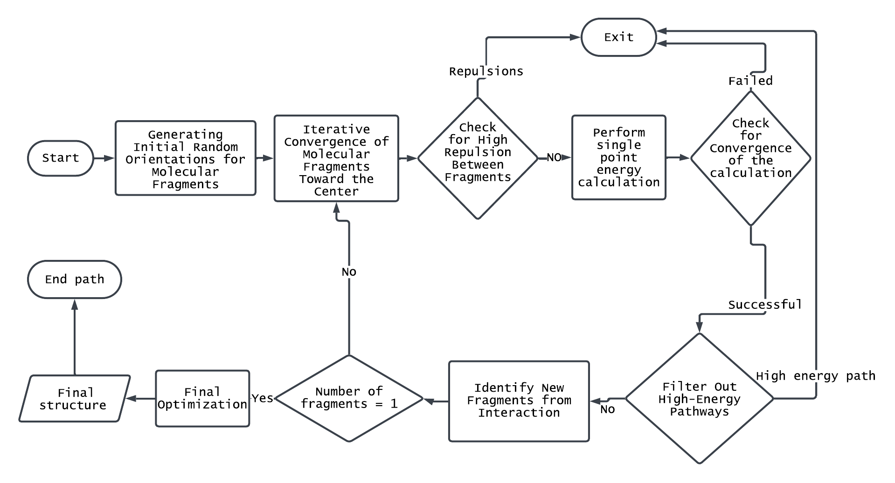
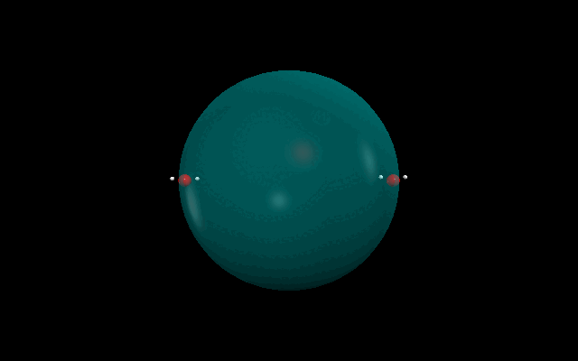

## Unbiased Reaction Path Search Algorithm (URPSA)
## How to install 

### Prerequisites 
* The program is written on python3.
* Currently, program only supports the linux operating system.
* Gaussian 16 has to be installed since calculations are conducted through that.
* Numpy and matplotlib libraries are used in the program 
```aiignore
pip install Numpy
pip install Matplotlib
```
---
### Installation 
```bash 
https://github.com/WMCSameeraGroup/URPSA.git
```
Use the command or download the file and extract the folder.

## How to Run 
To run the program you need to specify the path of the configuration file to the repeated.py python script.

the following command can be used to run the program
```bash
python3 "/<path-to-URPSA-directory>/repeated.py" exampleInput.txt
```
---

## Input file configuration
we have written a simple parser file for the organization of input parameters to the program.
The sections are **[SECTION]** defined with square brackets. 
predefined variables are placed on the left hand side and the values are defined by  

```buildoutcfg
[section]
variable = value
```
modify the input file to enter the inputs (*Molecules*, step_size, step_count, and etc )

- **update_with_optimized_coordinates**: keep the optimized configuration of molecules to the next method.
- **step size:** distance moved towards the center 
- **step_count:** number of steps should move towards the center
- **stop_distance_factor:** the factor that determines distance that the calculation should stop ; factor x (sum of covalent radius)
- **stress_release:** iterations that should be optimized without constraints. input is given as  start: step :end
- **spherical_placement:** how to place the molecular fragments on the hypothetical spherical.
- **ADD_COM_CONST:** whether to add center of mass constraints
- **dynamic_fragment_replacement:** if atoms are closer than given number value.


```buildoutcfg
# This is a comment
[project]
project_name = Project1

[controls]
# set this as false for now
update_with_optimized_coordinates = True
# in angstrum 
step_size = 0.1
step_count = 40
stop_distance_factor = 0.4


# add COM constraints = True
ADD_COM_CONST = False
dynamic_fragment_replacement = True

[gaussian]
number_of_cores = 8
memory = 8GB
method =#N opt(maxcycle=600,AddGIC) PM6 scf(maxcyc=600,xqc) nosymm


[molecules]
charge = 0
multiplicity = 2
number_of_molecules = 2

0 = C -0.69272980 -0.81618654 0.00000000\
H -0.33605696 -0.31178835 0.87365150\
H -0.33605696 -0.31178835 -0.87365150\
H -1.76272980 -0.81617336 0.00000000\
O -0.21607949 -2.16440926 0.00000000\
H -0.53442410 -2.61684869 0.78457331

# add \ to the end of a line if the next line continues
1 = O -0.21607949 -2.16440926 0.00000000\
H -0.53442410 -2.61684869 0.7845733

[Additional]
# use /- instead of = sign when using inside values

constraints = XCm1 (Inactive) /- XCntr(1-6) \
YCm1 (Inactive) /- YCntr(1-6) \
ZCm1 (Inactive) /- ZCntr(1-6)\
XCm2 (Inactive)  /- XCntr(7)\
YCm2 (Inactive)  /- YCntr(7) \
ZCm2 (Inactive) /- ZCntr(7)\
F1F2(FREEZE) /- sqrt[(XCm1-XCm2)^2+(YCm1-YCm2)^2+(ZCm1-ZCm2)^2]*0.529177

```
---

## Output data
Project outputs are saved in a directory inside the pwd with the project name that you specified in the input file.
Successfully observed reaction paths would be saved as **Pathways_xxxx** directories.
And inside those folders all the files related to the calculation would be saved.
Summary of a path is recorded by **output2.xyz** file.

if a pathway was unsuccessful that pathway is either removed or moved to the Archived folder depending on the input option that is given.
By default, it is Archived. 
---
## Default values 
the default values are stored as a dictionary 

```python
defaults = {
    "project": {
        "project_name": "new-project",
    },
    "controls": {
        "update_with_optimized_coordinates": "True",
        "step_size": 0.1,
        "step_count": 40,
        "stop_distance_factor": 0.8,
        "stress_release": "0:1:-1",
        "sphere_radius": 3,
        "n_iterations": 10,
        "spherical_placement": "statistically_even",
        "ADD_COM_CONST": "True",
        "ADD_SPHERICAL_CONST": "False",
        "dynamic_fragment_replacement": "False",
        "cutoff_energy_gap":120.0,
        "energy_surpass_options":"exit",
        "optimize_the_final_particle":"True",
        "convergence_error":"exit",
        "consecutive_duplicates_threshold":5,
        "unsuccessful_pathway":"archive"


    },
    "gaussian": {
        "number_of_cores": 1,
        "memory": "1GB",
        "method": "#N opt(maxcycle=200,AddGIC) WB97XD/6-31G* scf(maxcyc=300,xqc) nosymm"
    }
}

```

## Output format 


Each reaction path is saved with a folder named as Pathway_0001 and gaussian calculations files(input file, output files) are stored. 
further a scatter plot of the energy of converged structures as scatter.jpg and a xyz file is produced to see the trajectory. 

---

## Methodology

### Overview

The **Unbiased Reaction Path Search Algorithm (URPSA)** is an automated method for discovering reaction pathways through the systematic exploration of possible interactions between molecular fragments. The process is designed to minimize reliance on human intuition by providing a structured approach to identifying new pathways.

> The workflow of the URPSA is illustrated in the diagram below.  
> __

The process begins by placing user-defined molecular fragments randomly on the surface of a sphere. These fragments are then gradually moved toward the center to encourage interactions. At each step, the system checks for atomic repulsions and discards any unphysical configurations.

Next, the **single point energy** of the configuration is calculated using an external quantum chemistry package, *Gaussian16*. Bond formation between fragments is analyzed based on interatomic distances, and newly formed fragments are identified.

High-energy pathways are filtered out using a user-defined energy threshold, ensuring that only feasible routes are considered. Low-energy pathways are preserved for further analysis.

The entire process is automated through **Python**, while quantum mechanical calculations are carried out by *Gaussian16*.

---

### Random Orientation Generation

The calculation begins by randomly placing user-defined fragments (atoms or molecules) on the surface of a sphere of a given radius. Each fragment has an equal probability of being positioned at any point on the surface.

> _Note: Overlapping placements are automatically discarded in a later step._


The goal of spherical placement is to expose the potential energy surface (PES) to diverse orientations, thereby increasing the chances of discovering non-trivial interactions.

---

### Push Fragments Toward the Centre


Each fragment is moved inward toward the center of the coordinate system by a linear distance. This is performed by calculating the position vector of the fragment's center of mass and reducing it by a user-defined step size, effectively pushing fragments closer to encourage interaction.

---

### Check for Small Inter-Atomic Distances

Unphysical overlaps between atoms of different fragments are checked and eliminated. If any two atoms from separate fragments are closer than a specified multiple of their combined covalent radii, the pathway is discarded.

---

### Single Point Energy Calculation

For each iteration, a **single point energy** calculation is performed to assess the energy of the system at that configuration.

---

### Filter Out High-Energy Pathways

If the energy of a configuration exceeds that of the initial state by more than a specified threshold, the pathway is discarded. This step ensures only energetically feasible structures are retained.

**Energy gap expression:**

```math
\text{Energy gap} = \text{Energy}_{\text{current}} - \text{Energy}_{\text{initial}}
```

---

### Fragment Identification

When fragments interact, new bonds may form, resulting in newly connected substructures. A distance-based algorithm is used to identify such fragments. Two atoms are considered bonded if:

```math
d_{ij} < f \times (r_i + r_j)
```

Where:

- \( d_{ij} \) is the distance between atoms \( i \) and \( j \),
- \( r_i \), \( r_j \) are covalent radii,
- \( f \) is a tolerance factor, typically around 1.1.


---

### Fragment Count Check

If only a single fragment remains after interaction, it implies that all fragments have reacted to form one connected structure. At this point, further pushing is not possible. The resulting structure is then treated as the **observed product** and recorded, along with any constraints applied during the process.

---

### Final Optimization Without Constraints

The identified product is re-optimized without any geometric constraints to ensure it relaxes to its nearest energy minimum. A new input file is generated for this geometry optimization, allowing the system to converge to a true local minimum on the PES.

---


